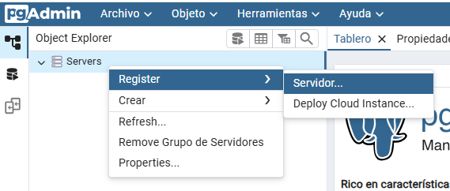
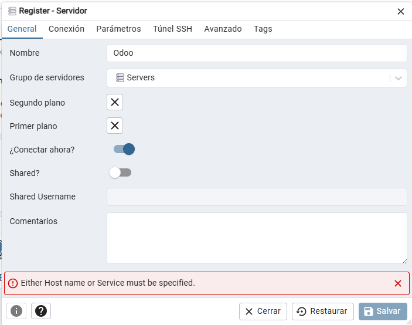
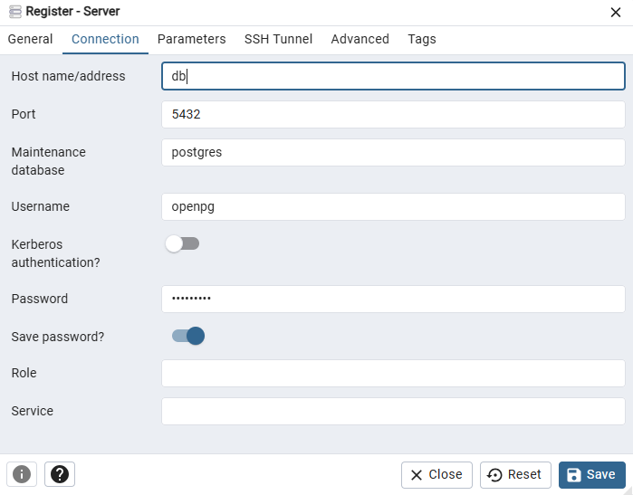
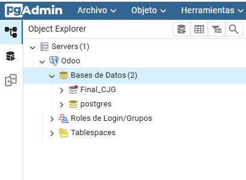

# Odoo en Docker

> [!NOTE] 
>Antes de ejecutar cualquier comando hay que abrir Docker desktop y darle a permitir a lo que aparezca.

>En caso de que aparezca Docker engine stopped seguir los siguientes pasos:
> 1. Instalar la extensión de docker en vs code
> 2. Cerrar todos los servicios que digan docker
> 3. Abrir docker desktop como admin

Una vez realizados estos pasos, al clonar el repositorio abrir un terminal en esta ubicación.

> [!NOTE]
> Este comando es para la versión 2.0 del script docker-compose

> [!NOTE]
>Antes de levantar el nuevo entorno ejecuta este comando para eliminar instalaciones previas
>```sh
>docker compose down -v
>```
> Una vez eliminados, y después de haber clonado el nuevo repositorio, para levantar el entorno de nuevo utiliza este comando
>```sh
>docker compose up --build
>```

## Odoo

> [!IMPORTANT]
> CJG son las iniciales de TU nombre y apellidos

De acuerdo al entorno Odoo que te indiquen debes usar una URL:

- Url: `http://localhost:8069` --- Actividad Final
- Master Password: `IFP123`
- Nombre base de datos: `Final_CJG` donde CJG son tus iniciales
- Password: `IFP123`
> [!IMPORTANT] 
> SELECCIONAR DEMO DATA

- Url: `http://localhost:8070` --- Examen
- Master Password: `IFP123`
- Nombre base de datos: `Examen_CJG` donde CJG son tus iniciales
- Password: `IFP123`

> [!IMPORTANT] 
> SELECCIONAR DEMO DATA

Hay que activar los siguientes modulos en el mismo orden:

- Compras
- Ventas
- Inventario
- CRM
- Empleados

## Pgadmin

- Url `http://localhost:5050`
- Email `admin@example.com`
- Password `admin`

> [!IMPORTANT]
> Al añadir una conexión según las siguientes instrucciones:




- Usuario: openpg
- Contraseña: openpgpwd



>El resultado esperado es el siguiente:



> [!IMPORTANT]
> Este es el comando que deberemos usar para levantar el contenedor cada vez que queramos usarlo.
>```sh
>docker compose up --build
>```

