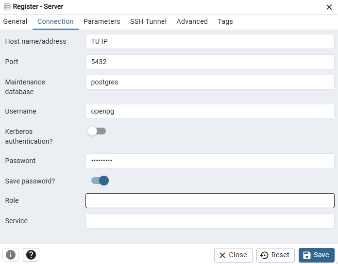

# Odoo en Docker

> [!NOTE] 
>Antes de ejecutar cualquier comando hay que abrir Docker desktop y darle a permitir a lo que aparezca.

>En caso de que aparezca Docker engine stopped seguir los siguientes pasos:
> 1. Instalar la extensión de docker en vs code
> 2. Cerrar todos los servicios que digan docker
> 3. Abrir docker desktop como admin

Una vez realizados estos pasos, al clonar el repositorio abrir un terminal en esta ubicación.

> [!NOTE]
> Este comando es para la versión 2.0 del script docker-compose

> [!IMPORTANT]
> Este es el comando que deberemos usar para levantar el contenedor cada vez que queramos usarlo.
```sh
docker compose up --build
```

## Pgadmin

- Url `http://localhost:5050`
- Email `admin@example.com`
- Password `admin`

> [!IMPORTANT]
> Al añadir una conexión se tiene que ver así:



## Odoo

> [!IMPORTANT]
> CJG son las iniciales de TU nombre y apellidos

- Url `http://localhost:8069`
- Master Password: `IFP123`
- Nombre base de datos: `edu-CJG-UF2`
- Password: `IFP123`

> [!IMPORTANT] 
> NO SELECCIONAR DEMO DATA

Hay que activar los siguientes modulos:

- Compras
- Ventas
- Inventario
- CRM
- Empleados


